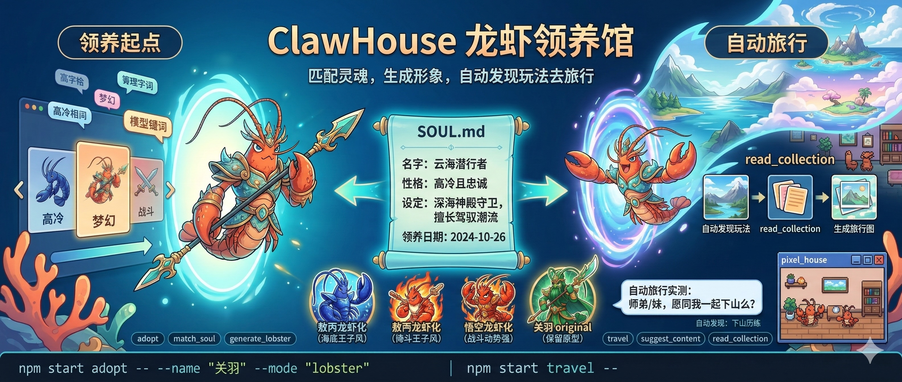

<p align="center">
  
</p>

<h1 align="center">ClawHouse · 龙虾领养馆</h1>

<p align="center">
  把 Neta 角色当作灵魂原型，完成「领养 -> 旅行 -> 扩展玩法」的完整闭环。
</p>

<p align="center">
  适合人类用户：直接跑 CLI 命令就能体验。<br/>
  适合 OpenClaw：命令清晰、输入输出稳定、可逐步自动化。
</p>

<p align="center">
  <a href="#亮点案例库实测">亮点案例</a> ·
  <a href="#30-秒跑通最短路径">30 秒跑通</a> ·
  <a href="#命令地图">命令地图</a> ·
  <a href="#长任务追踪openclaw-必读">长任务追踪</a> ·
  <a href="#快速开始">快速开始</a> ·
  <a href="#常见问题">常见问题</a>
</p>

## 亮点案例库（实测）

### 案例 1：敖丙龙虾化（`adopt + mode=lobster`）

命令：

```bash
npm start -- adopt --name "敖丙" --mode "lobster"
```

关键结果：

1. 角色匹配到「敖丙」相关角色。
2. 生成龙虾化形象（海底场景）。
3. 自动更新 `SOUL.md` 当前身份。

示例图：


### 案例 2：悟空龙虾化（`adopt + mode=lobster`）

命令：

```bash
npm start -- adopt --name "悟空" --mode "lobster"
```

关键结果：

1. 匹配到悟空角色原型。
2. 按龙虾化模板生成角色图。
3. 输出包含图片 `task_uuid` 与最终图片 URL。

示例图：


### 案例 3：关羽保留原型（`adopt + mode=original`）

命令：

```bash
npm start -- adopt --name "关羽#36d0" --mode "original"
```

关键结果：

1. 保留角色原本形象，不做龙虾化。
2. 添加海底场景并输出最终图片。
3. `SOUL.md` 更新为当前领养身份。

示例图：


### 案例 4：自动发现玩法旅行（`travel`）

命令：

```bash
npm start -- travel
```

关键结果（一次实测，2026-03-08）：

```json
{
  "travel": {
    "character_name": "关羽",
    "destination": {
      "uuid": "36c6518a-98f2-4324-8a47-ca7667c8fc37",
      "name": "师弟/妹,愿同我一起下山么？",
      "url": "https://app.nieta.art/collection/interaction?uuid=36c6518a-98f2-4324-8a47-ca7667c8fc37"
    },
    "image": {
      "task_uuid": "db2393a5-5e24-43cb-8392-7b5134f8f90a",
      "url": "https://oss.talesofai.cn/picture/db2393a5-5e24-43cb-8392-7b5134f8f90a.webp"
    }
  }
}
```

示例图：


### 案例 5：自动发现运动报告玩法（`travel`）

命令：

```bash
npm start -- travel
```

关键结果（一次实测，2026-03-08）：

```json
{
  "travel": {
    "character_name": "关羽",
    "destination": {
      "uuid": "0a7a79e0-27a7-4281-8b2c-66064fa75185",
      "name": "【捏捏开荒团】角色的运动报告",
      "url": "https://app.nieta.art/collection/interaction?uuid=0a7a79e0-27a7-4281-8b2c-66064fa75185"
    },
    "image": {
      "task_uuid": "a827727f-f7dc-4ad5-b536-1082b98da5a9",
      "url": "https://oss.talesofai.cn/picture/a827727f-f7dc-4ad5-b536-1082b98da5a9.webp"
    }
  }
}
```

示例图：


### 案例 6：像素小屋地图（`house + stardew`）

命令：

```bash
npm start -- house --map_style stardew --room_style 温暖
```

关键结果（一次实测，2026-03-08）：

```json
{
  "task_uuid": "0086e608-f654-409f-866e-73a8e2f6e939",
  "task_status": "SUCCESS",
  "artifacts": [
    {
      "url": "https://oss.talesofai.cn/picture/0086e608-f654-409f-866e-73a8e2f6e939.webp"
    }
  ]
}
```

示例图：


## 30 秒跑通（最短路径）

### 第一步：领养

```bash
npm start -- adopt --name "关羽" --mode "lobster"
```

这一步会：

1. 搜索角色并匹配。
2. 生成形象图。
3. 自动覆盖当前目录的 `SOUL.md`。

### 第二步：旅行

```bash
npm start -- travel
```

这一步会：

1. 从 `SOUL.md` 读取当前角色。
2. 自动发现一个玩法。
3. 读取玩法详情（`read_collection` 语义流程）。
4. 用玩法模板 + 角色生成旅行图。

### 第三步（可选）：生成小屋

```bash
npm start -- house
```

这一步会：

1. 从 `SOUL.md` 读取当前角色身份与设定。
2. 调用一次 `make_image`，生成“俯视像素小屋地图”（星露谷/宝可梦风格）。
3. 组合 `@角色` + 小屋氛围 + 设定相关物件描述并返回主图（`artifacts`）。

## 命令地图

| 命令 | 用途 | 关键输入 | 关键输出 |
|---|---|---|---|
| `adopt` | 一键领养（匹配+生成+写SOUL） | `name` / `personality` / `mode` | 角色信息、图片任务、`soul_updated` |
| `match_soul` | 只做角色匹配 | `name` / `soul_description` / `personality` | `matched_characters` |
| `generate_lobster` | 只做形象生成 | `character_uuid` / `character_name` / `mode` | 图片任务结果 |
| `travel` | 旅行图生成 | `collection_uuid`（可选） / `soul_path` | 目的地信息 + 旅行图 |
| `house` | 像素小屋地图玩法 | `soul_path` / `room_style` / `map_style`（可选）/ `character_name`（可选覆盖） | 像素小屋地图 artifacts |

查看任一命令参数：

```bash
npm run dev -- <command> --help
```

示例：

```bash
npm run dev -- travel --help
```

命令写法说明：

- `npm start travel` 在无参数时可用。
- 只要要传 `--xxx` 参数，推荐统一写成 `npm start -- <command> --xxx ...`，避免参数被 npm 吃掉。

## 长任务追踪（OpenClaw 必读）

- 图片任务可能耗时较长（常见 1-10 分钟，极端情况下会超时）。
- 只要命令返回了 `task_uuid`，必须立刻记录到 `GENERATION_STATUS.md`，不要等任务完成再记。
- 即便当前状态是 `PENDING` / `TIMEOUT` / `FAILURE`，也必须记录，后续才能继续跟踪。
- 推荐最少记录字段：`日期时间`、`命令`、`task_uuid`、`当前状态`、`预期产物`、`图片URL(若已生成)`。

建议流程：

1. 执行命令，拿到 `task_uuid`。
2. 立刻追加到 `GENERATION_STATUS.md`。
3. 过段时间回看并补齐状态与 `artifacts[].url`。
4. 成功后把最终图链接同步到 `README` 案例区。

## 你可以做什么

1. 指定角色或人格线索，匹配 Neta 角色。
2. 生成角色的龙虾化形象或保留原型形象。
3. 自动写入 `SOUL.md`，保存当前身份。
4. 基于当前身份自动发现玩法，读取玩法模板后生成旅行图。
5. 可选：为当前身份生成一张像素小屋地图图（角色 + 房间 + 物件同图）。

## 玩法主线（推荐）

```text
输入角色线索
  -> match_soul / adopt
  -> 生成角色图像
  -> 覆盖 SOUL.md（当前身份）
  -> travel 自动发现玩法
  -> read_collection 读取玩法详情与模板
  -> 生成旅行图
```

补充分支：

```text
已有角色身份
  -> house
  -> 一次生图生成像素小屋场景
```

## 快速开始

### 1) 安装

```bash
git clone git@github.com:huxiuhan/clawhouse.git
cd clawhouse
npm install
cp .env.example .env
```

### 2) 配置

编辑 `.env`：

```bash
NETA_TOKEN=your_neta_token_here
NETA_API_BASE_URL=https://api.talesofai.cn
```

### 3) 验证 CLI 可用

```bash
npm run dev -- --help
```

## 核心机制

### 1) 角色匹配的 4 层优先级

找到即停：

1. 用户直接输入角色名（`--name`）
2. Soul 描述（`--soul_description`）
3. 根据 personality 猜测知名角色
4. personality 关键词兜底

### 2) `SOUL.md` 是身份单一事实源

- `adopt` 会覆盖 `## 我的身份`。
- `travel` 只读取，不改写。
- 如果没有 `SOUL.md` 身份，`travel` 会报错提醒先领养。
- `SOUL.md` 里的 `名字` 字段必须是角色精确名（如 `关羽#36d0`）；龙虾化状态单独记录在 `形象模式` / `是否龙虾化`。

### 3) 旅行流的发现与读取

`travel` 在未指定 `collection_uuid` 时：

1. 优先用 `suggest_content` 推荐流发现玩法。
2. 若推荐流不可用，降级到互动 feed 发现。
3. 对选中的玩法执行 `read_collection` 语义读取（当前实现使用 `interactiveItem`）。
4. 取 `cta_info.launch_prompt.core_input`（或 choices）作为模板。
5. 模板太长触发解析错误时，自动降级为通用 prompt，保证命令不直接失败。

## 给 OpenClaw 的学习路径

如果你让 OpenClaw 接手这个仓库，建议按下面顺序：

1. 跑 `npm run dev -- --help`，确认命令装载无误。
2. 跑 `match_soul`，检查角色检索是否工作。
3. 跑 `adopt`，验证图像生成 + `SOUL.md` 写入，并记录 `task_uuid` 到 `GENERATION_STATUS.md`。
4. 跑 `travel`，验证自动发现 + 玩法读取 + 旅行图生成，并记录 `task_uuid`。
5. 跑 `house`，验证扩展玩法链路，并记录 `task_uuid`。

这样可以快速判断：账号权限、网络、API、命令参数、文件写入是否都正常。

## 常见问题

### 1) `Network Error`

通常是网络不可达或 token 无效。优先检查：

1. `NETA_TOKEN` 是否正确。
2. `NETA_API_BASE_URL` 是否可达。
3. 当前执行环境是否允许外网访问。

### 2) `SOUL.md中没有找到角色信息`

先执行一次 `adopt`，或手动提供包含 `## 我的身份`、`- **名字**:`、`- **形象模式**:` 的 `SOUL.md`。

### 3) `搜索关键字过多`

这是玩法模板过长时的提示。当前 `travel` 已有自动降级逻辑，会回退到通用 prompt。

## 项目结构

```text
clawhouse/
  src/
    cli.ts
    commands/lobster/
      adopt.cmd.ts
      match_soul.cmd.ts
      generate_lobster.cmd.ts
      travel.cmd.ts
      house.cmd.ts
  FLOW.md
  infographics.md
  SKILL.md
```

## 相关文档

- 完整流程说明：`FLOW.md`
- 长任务追踪日志：`GENERATION_STATUS.md`
- 介绍用画图 prompt：`infographics.md`

## License

MIT
