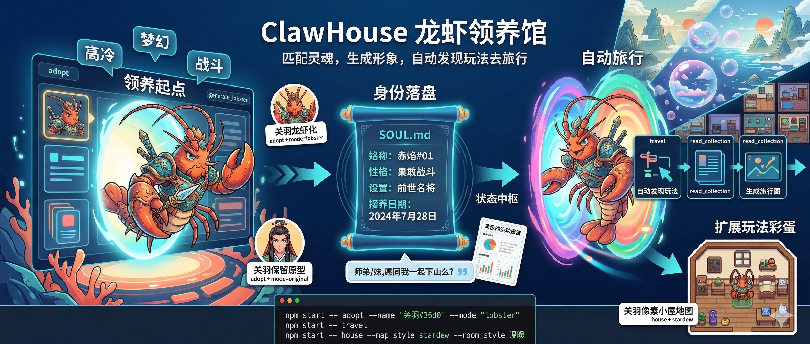

<p align="center">
  
</p>

<h1 align="center">ClawHouse · Lobster Adoption House</h1>

<p align="center">
  <strong>Language / 语言:</strong>
  <a href="./README_EN.md">English</a> |
  <a href="./README.md">中文</a>
</p>

<p align="center">
  Use Neta characters as soul archetypes to complete a full loop of
  "adopt -> travel -> gameplay expansion."
</p>

<p align="center">
  For human users: run CLI commands directly to experience it.<br/>
  For OpenClaw: clear commands, stable I/O, and incremental automation.
</p>

<p align="center">
  <a href="#showcase-tested-examples">Showcase</a> ·
  <a href="#30-second-run-shortest-path">30-Second Run</a> ·
  <a href="#command-map">Command Map</a> ·
  <a href="#long-task-tracking-openclaw-must-read">Long Task Tracking</a> ·
  <a href="#quick-start">Quick Start</a> ·
  <a href="#faq">FAQ</a>
</p>

## Showcase (Tested Examples)

### Example 1: Ao Bing in Lobster Mode (`adopt + mode=lobster`)

Command:

```bash
npm start -- adopt --name "敖丙" --mode "lobster"
```

Key results:

1. Matched to the Ao Bing-related character.
2. Generated a lobster-style character image (underwater scene).
3. Automatically updated the current identity in `SOUL.md`.

Sample image:


### Example 2: Wukong in Lobster Mode (`adopt + mode=lobster`)

Command:

```bash
npm start -- adopt --name "悟空" --mode "lobster"
```

Key results:

1. Matched to the Wukong archetype.
2. Generated a character image using the lobster template.
3. Output includes the image `task_uuid` and final image URL.

Sample image:


### Example 3: Guan Yu Keeping Original Form (`adopt + mode=original`)

Command:

```bash
npm start -- adopt --name "关羽#36d0" --mode "original"
```

Key results:

1. Preserved the original character appearance (no lobster transformation).
2. Added an underwater scene and output the final image.
3. `SOUL.md` updated to the current adopted identity.

Sample image:


### Example 4: Auto-Discovered Gameplay Travel (`travel`)

Command:

```bash
npm start -- travel
```

Key results (one test run, 2026-03-08):

```json
{
  "travel": {
    "character_name": "关羽",
    "destination": {
      "uuid": "36c6518a-98f2-4324-8a47-ca7667c8fc37",
      "name": "师弟/妹,愿同我一起下山么？",
      "url": "https://app.nieta.art/collection/interaction?uuid=36c6518a-98f2-4324-8a47-ca7667c8fc37"
    },
    "image": {
      "task_uuid": "db2393a5-5e24-43cb-8392-7b5134f8f90a",
      "url": "https://oss.talesofai.cn/picture/db2393a5-5e24-43cb-8392-7b5134f8f90a.webp"
    }
  }
}
```

Sample image:


### Example 5: Auto-Discovered Exercise Report Gameplay (`travel`)

Command:

```bash
npm start -- travel
```

Key results (one test run, 2026-03-08):

```json
{
  "travel": {
    "character_name": "关羽",
    "destination": {
      "uuid": "0a7a79e0-27a7-4281-8b2c-66064fa75185",
      "name": "【捏捏开荒团】角色的运动报告",
      "url": "https://app.nieta.art/collection/interaction?uuid=0a7a79e0-27a7-4281-8b2c-66064fa75185"
    },
    "image": {
      "task_uuid": "a827727f-f7dc-4ad5-b536-1082b98da5a9",
      "url": "https://oss.talesofai.cn/picture/a827727f-f7dc-4ad5-b536-1082b98da5a9.webp"
    }
  }
}
```

Sample image:


### Example 6: Pixel House Map (`house + stardew`)

Command:

```bash
npm start -- house --map_style stardew --room_style 温暖
```

Key results (one test run, 2026-03-08):

```json
{
  "task_uuid": "0086e608-f654-409f-866e-73a8e2f6e939",
  "task_status": "SUCCESS",
  "artifacts": [
    {
      "url": "https://oss.talesofai.cn/picture/0086e608-f654-409f-866e-73a8e2f6e939.webp"
    }
  ]
}
```

Sample image:


## 30-Second Run (Shortest Path)

### Step 1: Adopt

```bash
npm start -- adopt --name "关羽" --mode "lobster"
```

This step will:

1. Search and match a character.
2. Generate a character image.
3. Automatically overwrite `SOUL.md` in the current directory.

### Step 2: Travel

```bash
npm start -- travel
```

This step will:

1. Read the current character from `SOUL.md`.
2. Auto-discover one gameplay entry.
3. Read gameplay details (`read_collection` semantic flow).
4. Generate a travel image using gameplay template + character.

### Step 3 (Optional): Generate a House

```bash
npm start -- house
```

This step will:

1. Read current identity and settings from `SOUL.md`.
2. Call `make_image` once to generate a top-down pixel house map (Stardew/Pokemon style).
3. Combine `@character` + house atmosphere + setting-related objects and return the main image (`artifacts`).

## Command Map

| Command | Purpose | Key Inputs | Key Outputs |
|---|---|---|---|
| `adopt` | One-click adoption (match + generate + write SOUL) | `name` / `personality` / `mode` | Character info, image task, `soul_updated` |
| `match_soul` | Character matching only | `name` / `soul_description` / `personality` | `matched_characters` |
| `generate_lobster` | Image generation only | `character_uuid` / `character_name` / `mode` | Image task result |
| `travel` | Travel image generation | `collection_uuid` (optional) / `soul_path` | Destination info + travel image |
| `house` | Pixel house map gameplay | `soul_path` / `room_style` / `map_style` (optional) / `character_name` (optional override) | Pixel house map artifacts |

View parameters for any command:

```bash
npm run dev -- <command> --help
```

Example:

```bash
npm run dev -- travel --help
```

Command syntax note:

- `npm start travel` works when there are no extra parameters.
- If you pass `--xxx` parameters, use `npm start -- <command> --xxx ...` to prevent npm from swallowing args.

## Long Task Tracking (OpenClaw Must Read)

- Image tasks may take a long time (commonly 1-10 minutes; extreme cases can time out).
- As long as a command returns `task_uuid`, record it to `GENERATION_STATUS.md` immediately. Do not wait for completion.
- Even if current status is `PENDING` / `TIMEOUT` / `FAILURE`, still record it for later tracking.
- Recommended minimum fields: `datetime`, `command`, `task_uuid`, `current_status`, `expected_artifact`, `image_url` (if generated).

Recommended process:

1. Run command and obtain `task_uuid`.
2. Append it to `GENERATION_STATUS.md` immediately.
3. Revisit later and fill in status and `artifacts[].url`.
4. After success, sync final image link to README showcase section.

## What You Can Do

1. Match Neta characters by specified character clues or personality clues.
2. Generate lobster-style character images or keep original character images.
3. Auto-write `SOUL.md` to save the current identity.
4. Auto-discover gameplay from current identity, read gameplay template, then generate travel image.
5. Optional: generate one pixel house map image for current identity (character + room + objects in one image).

## Main Gameplay Flow (Recommended)

```text
Input character clues
  -> match_soul / adopt
  -> generate character image
  -> overwrite SOUL.md (current identity)
  -> travel auto-discovers gameplay
  -> read_collection reads gameplay details and template
  -> generate travel image
```

Supplementary branch:

```text
Existing character identity
  -> house
  -> one image generation for pixel house scene
```

## Quick Start

### 1) Install

```bash
git clone git@github.com:huxiuhan/clawhouse.git
cd clawhouse
npm install
cp .env.example .env
```

### 2) Configure

Edit `.env`:

```bash
NETA_TOKEN=your_neta_token_here
NETA_API_BASE_URL=https://api.talesofai.cn
```

### 3) Verify CLI Availability

```bash
npm run dev -- --help
```

## Core Mechanisms

### 1) Four-Level Priority for Character Matching

Stop once matched:

1. User directly inputs character name (`--name`)
2. Soul description (`--soul_description`)
3. Guess well-known characters from personality
4. Personality keyword fallback

### 2) `SOUL.md` Is the Single Source of Truth for Identity

- `adopt` overwrites `## 我的身份`.
- `travel` only reads, never rewrites.
- If no identity is found in `SOUL.md`, `travel` throws an error asking you to adopt first.
- The `名字` field in `SOUL.md` must be the exact character name (for example `关羽#36d0`); lobster status is recorded separately in `形象模式` / `是否龙虾化`.

### 3) Discovery and Reading in Travel Flow

When `collection_uuid` is not specified for `travel`:

1. It first tries to discover gameplay via `suggest_content`.
2. If recommendations are unavailable, it falls back to interaction feed discovery.
3. It performs semantic `read_collection` on selected gameplay (current implementation uses `interactiveItem`).
4. It uses `cta_info.launch_prompt.core_input` (or choices) as template.
5. If template is too long and triggers parse errors, it automatically falls back to a generic prompt so the command does not fail directly.

## Learning Path for OpenClaw

If you hand this repo to OpenClaw, use this order:

1. Run `npm run dev -- --help` to confirm command loading is correct.
2. Run `match_soul` to check if character retrieval works.
3. Run `adopt` to verify image generation + `SOUL.md` write, and log `task_uuid` to `GENERATION_STATUS.md`.
4. Run `travel` to verify auto-discovery + gameplay reading + travel image generation, and log `task_uuid`.
5. Run `house` to verify expanded gameplay chain, and log `task_uuid`.

This quickly verifies whether account permissions, network, API, command args, and file writing are all working.

## FAQ

### 1) `Network Error`

Usually due to unreachable network or invalid token. Check first:

1. Whether `NETA_TOKEN` is correct.
2. Whether `NETA_API_BASE_URL` is reachable.
3. Whether the current runtime environment allows external network access.

### 2) `SOUL.md中没有找到角色信息`

Run `adopt` first, or manually provide a `SOUL.md` containing `## 我的身份`, `- **名字**:`, and `- **形象模式**:`.

### 3) `搜索关键字过多`

This appears when the gameplay template is too long. Current `travel` has auto-downgrade logic and falls back to a generic prompt.

## Project Structure

```text
clawhouse/
  src/
    cli.ts
    commands/lobster/
      adopt.cmd.ts
      match_soul.cmd.ts
      generate_lobster.cmd.ts
      travel.cmd.ts
      house.cmd.ts
  FLOW.md
  infographics.md
  SKILL.md
```

## Related Docs

- Full process description: `FLOW.md`
- Long task tracking log: `GENERATION_STATUS.md`
- Intro graphic prompt: `infographics.md`

## License

MIT
